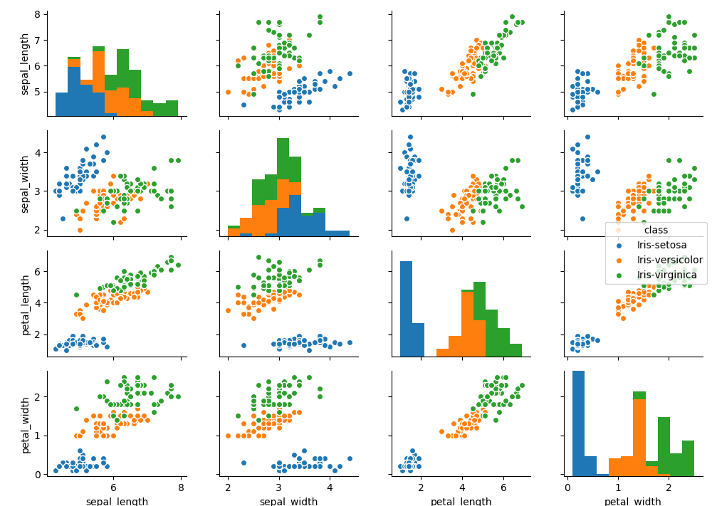

# Simple Data Analyzer

The purpose of this project is to provide set of tools to transform raw data in csv format into graphical representation.

# Requirement

* Python3
* matplotlib
* pandas
* seaborn

# Motivation

Sometime, we can find interesting information by simply transforming data into it's graphical representation.

# Pair Plot

## Formal Usage

```
python3 pairplot.py [filename=data.csv] [hue=None] [separator=','] [delimiter=None]
```

## Expected CSV Format

```
sepal_length,sepal_width,petal_length,petal_width,class
5.1,3.5,1.4,0.2,Iris-setosa
4.9,3.0,1.4,0.2,Iris-setosa
4.7,3.2,1.3,0.2,Iris-setosa
4.6,3.1,1.5,0.2,Iris-setosa
...
```

## Usage

```
python3 pairplot.py data.csv hue
```

## Expected Result



# Other Plots (Will be Added When I Need It)
